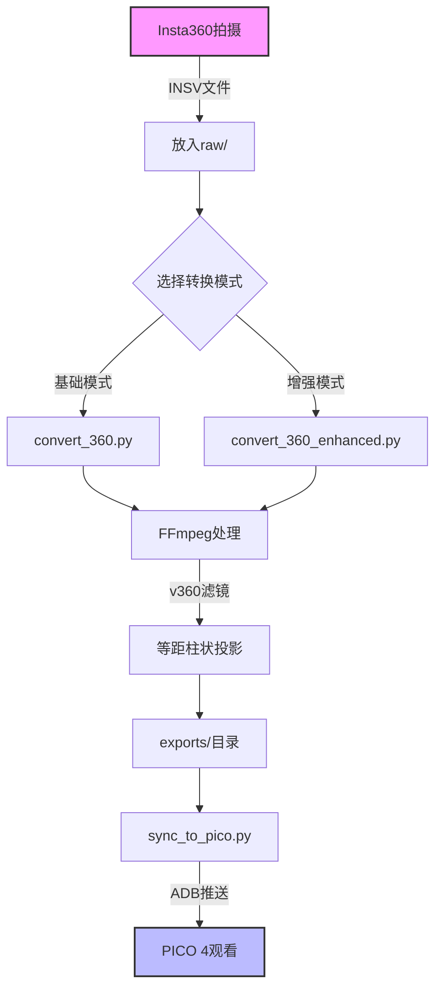
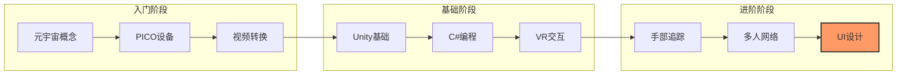
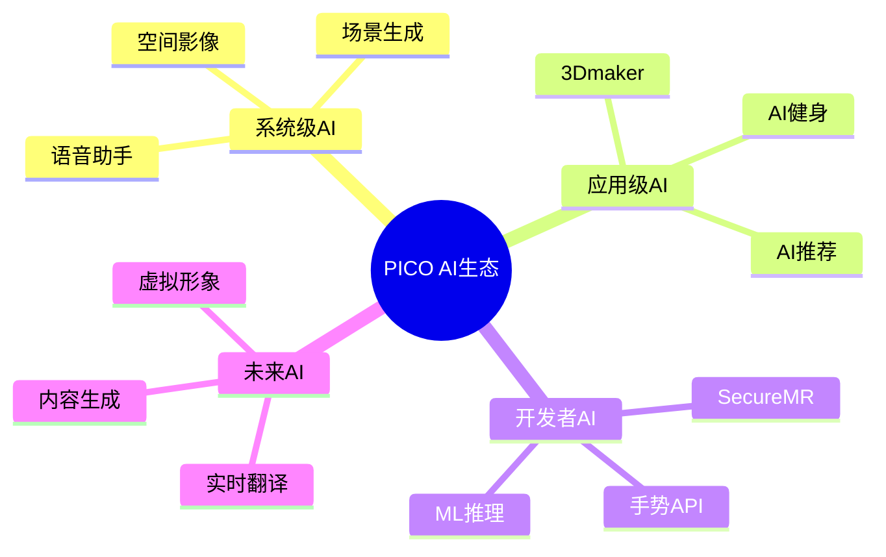
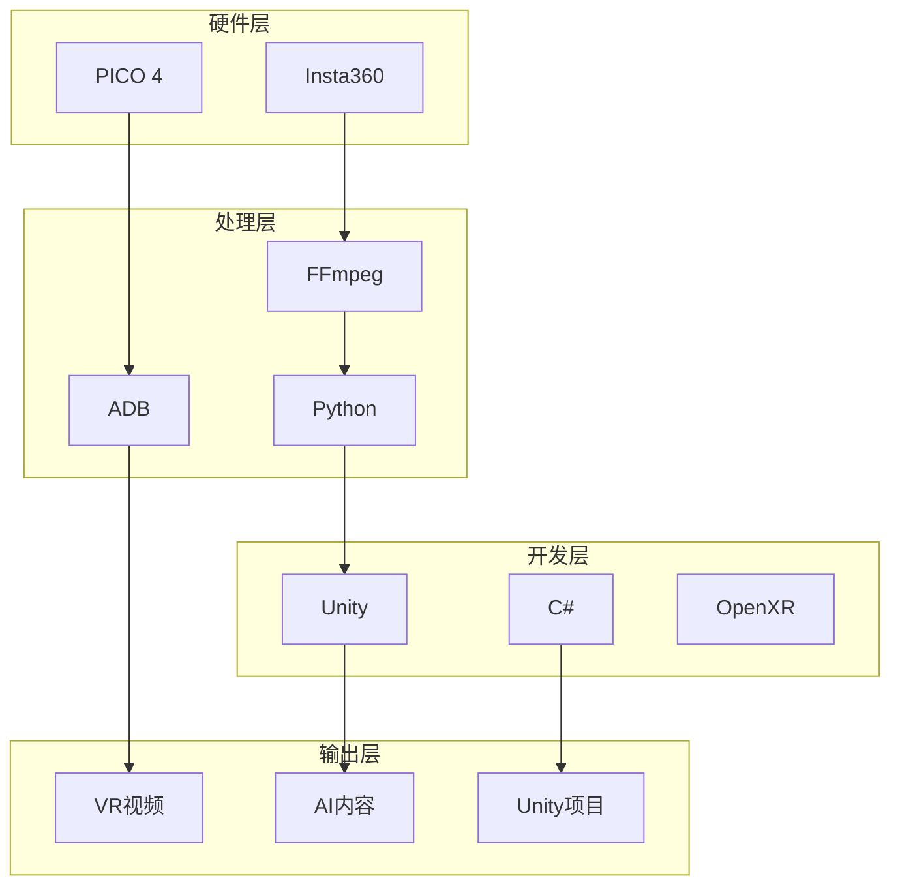

<div align="center">


</div>

<h1 align="center">👓 PICO 4 VR 项目工具箱</h1>

<p align="center">
  <strong>一站式 PICO 4 VR 开发与元宇宙探索解决方案</strong>
</p>

<p align="center">
  <a href="#功能特性">功能特性</a> •
  <a href="#快速开始">快速开始</a> •
  <a href="#学习体系">学习体系</a> •
  <a href="#pico-ai应用">PICO AI应用</a> •
  <a href="#贡献指南">贡献指南</a>
</p>

---

## ✨ 为什么选择本项目?

| 特性 | 本项目 | 传统方案 |
|:---:|:---:|:---:|
| 🎬 视频转换 | ⚡ 一键自动 | 🔧 手动操作 |
| 📚 学习资源 | 📖 完整体系 | 🔍 分散难找 |
| 🤖 AI内容 | 🎨 内置生成 | ❌ 无 |
| 💻 示例代码 | ✅ 即用模板 | ✏️ 从零编写 |
| 🇨🇳 中文支持 | 💯 完整文档 | 🌐 英文为主 |
| 🆓 开源免费 | MIT许可 | 部分收费 |

---

## 🚀 功能特性

### 🎬 Insta360 视频流水线

```
Insta360 拍摄 → raw/ 目录 → 自动转换 → exports/ → 同步到 PICO 4
```

- **双模式转换**: 基础模式 / 增强模式 (推荐)
- **智能检测**: FFmpeg + v360 滤镜自动验证
- **相机预设**: X3 / X4 / ONE_X2 一键配置
- **参数可调**: FOV、分辨率、质量、编码器全自定义

### 🤖 AI 内容生成器

| 生成器 | 输出 | 用途 |
|:---:|:---|:---|
| 🌲 场景生成 | JSON + Unity脚本 | 快速搭建VR世界 |
| 👤 Avatar生成 | 完整角色配置 | VRChat/元宇宙形象 |
| 📖 故事生成 | 剧本+控制器脚本 | 互动式叙事应用 |

### 📚 完整学习体系

```
入门(1周) → 基础(1月) → 进阶(2月) → 高级(半年) → 专家(持续)
   ↓           ↓          ↓           ↓          ↓
 元宇宙概念   Unity基础   手部追踪    Shader编程   商业发布
 PICO设备     C#编程      多人网络    性能优化     运营推广
 视频转换     VR交互      UI设计     AI系统       社区建设
```

### 💻 即用型代码

```csharp
// HelloPICO.cs - 控制器交互
public class HelloPICO : MonoBehaviour {
    void Update() {
        if (PXR_Input.GetControllerButtonDown(...)) {
            // 你的逻辑
        }
    }
}

// VRMovement.cs - 移动传送系统
public class VRMovement : MonoBehaviour {
    // 支持摇杆移动、瞬移、旋转
}
```

---

## 🎯 快速开始

### 环境要求

- Python 3.10+
- [FFmpeg](https://ffmpeg.org/) (视频处理)
- ADB (可选, 设备同步)

### 安装

```bash
# 克隆项目
git clone https://github.com/kevinten-ai/pico4-insta360-guide.git
cd pico4-insta360-guide

# 安装依赖
pip install -r requirements.txt
```

### 使用

```bash
# 交互式菜单
python main.py

# 或命令行
python main.py convert   # 转换视频
python main.py sync      # 同步到PICO
python main.py ai        # AI内容生成
python main.py learn     # 查看资源
python main.py all       # 全部执行
```

### 转换示例

```bash
# 1. 将 .insv 文件放入 raw/
# 2. 运行转换
python convert_360_enhanced.py --camera X3 --crf 22

# 3. 结果在 exports/
```

<details>
<summary>🔧 高级参数</summary>

```bash
python convert_360_enhanced.py \
  --camera X4 \              # 相机型号
  --preset medium \         # 编码速度
  --crf 20 \                # 质量 (越小越好)
  --resolution 5760:2880 \  # 输出分辨率
  --ih-fov 190 \            # 水平视场角
  --iv-fov 190 \            # 垂直视场角
  --status                  # 仅查看状态
```

</details>

---

## 📚 学习体系

### 教程文档 (`tutorials/`)

| 文档 | 描述 | 适合 |
|:---|:---|:---|
| [01_quick_start](tutorials/01_quick_start.md) | 5分钟上手指南 | 所有人 |
| [02_insta360_conversion](tutorials/02_insta360_to_pico_conversion.md) | 转换原理+FFmpeg详解 | 创作者 |
| [03_pico4_setup](tutorials/03_pico4_setup_guide.md) | 设备设置+故障排除 | 新手 |
| [04_ai_content](tutorials/04_ai_content_guide.md) | AI生成器使用手册 | 开发者 |

### 学习资源 (`learning/`)

| 文档 | 阶段 | 内容 |
|:---|:---:|:---|
| [01_metaverse](learning/01_metaverse_introduction.md) | L1 | 元宇宙概念、核心技术 |
| [02_vr_basics](learning/02_vr_development_basics.md) | L2 | Unity/C#/XR基础 |
| [03_advanced](learning/03_advanced_topics.md) | L3 | 手部追踪/多人/优化 |
| [04_roadmap](learning/04_vr_development_roadmap.md) | ALL | 5阶段完整路线图 |

---

## 🤖 PICO AI应用生态

### 系统级 AI 功能

#### 1. AI 大模型语音助手 🎙️
- **功能**: 语音指令控制设备
- **使用场景**: 
  - "播放星空冥想"
  - "开启健身课程"
  - 智能匹配环境音效和画面场景
- **设备**: PICO 4 Ultra (骁龙XR2 Gen 2支持)

#### 2. AI 生成 360° 场景壁纸 🎨
- **功能**: 一键生成360度虚拟场景
- **特点**: 
  - 2025年1月25日起无限次免费使用
  - 可应用为主控室场景
  - 结合AI大模型生成个性化环境

#### 3. AI 空间影像处理 📸
- **2D转3D照片**: 一键将普通照片转为空间影像
- **多帧降噪(MFNR)**: 提升低光环境成像质量
- **深度重建算法**: 基于双目视差实现3D效果
- **iPhone空间照片兼容**: 支持iPhone 15 Pro+拍摄的空间照片

### PICO 应用商店 AI 工具

#### ⭐ PICO 3Dmaker - 官方AI视频转3D工具

| 项目 | 详情 |
|------|------|
| **功能** | AI算法将平面视频转为立体3D效果 |
| **官网** | https://www.picoxr.com/cn/video/aito3d |
| **版本** | 1.1.1 (2026-03-17) |
| **大小** | 120.18 MB |
| **价格** | 免费 |

**系统要求**:
- Windows 10 64位及以上
- NVIDIA GeForce RTX 3060+ (30/40系列)
- 不支持RTX 50系列和AMD显卡

**使用步骤**:
```
1. 导入视频 → 2. AI自动转换 → 3. 一键导入PICO观看
```

**特点**:
- ✅ 支持批量处理多条视频
- ✅ 全程可视化界面，三步完成
- ✅ 转换完成后直接同步至PICO视频
- ✅ 免费面向所有用户

### MR/空间计算中的 AI 能力

#### 实时环境感知
- **实时网格扫描**: 深度传感器+神经网络
- **语义识别**: 自动识别环境物体类型
- **平面估计**: 智能识别桌面、地面等平面
- **动态物体隔离**: 精准去除移动物体和噪声

#### 手势识别 AI
- **纯手势模式**: 无需手柄，仅用手势交互
- **低延迟追踪**: 优化后的手势算法
- **暗光环境支持**: 提升暗光下手势稳定性

#### 空间音频 AI
- **环境感知音效**: 根据真实空间表面调整音频
- **动态声场**: 根据用户方位和动作调整

### 第三方 AI 应用生态

PICO应用商店已有 **750+ VR应用** 和 **50+ MR应用**，其中包含：

| 应用名 | AI功能 | 类型 |
|--------|--------|------|
| PICO视频 | AI推荐、AI场景生成 | 系统应用 |
| PICO 3Dmaker | 2D转3D视频 | 创作工具 |
| 多合一运动 | AI健身指导 | 健身 |
| DeoVR | AI画质优化 | 视频播放 |
| VRChat | AI NPC (部分世界) | 社交 |

### 开发者可用的 AI 工具

#### PICO 开发者平台支持：
1. **本地 ML 推理**: 设备端运行AI模型
2. **SecureMR**: 隐私安全的AI运行环境
3. **WebSpatial**: Web端的AI集成
4. **手势追踪 API**: 高精度手势识别接口

### 未来AI功能预告

根据PICO路线图，即将推出的AI功能：
- [ ] 更强大的AI助手集成
- [ ] AI实时翻译
- [ ] AI内容生成工具
- [ ] AI驱动的虚拟形象
- [ ] 云端AI加速支持

---


## 📊 架构图与流程图

### 工作流程


### 学习路径


### AI生态系统


### 技术栈架构


---

## 📁 项目结构

```
vr/
├── 🎬 核心模块
│   ├── main.py                     # 主入口 (交互菜单)
│   ├── convert_360.py              # 基础转换
│   ├── convert_360_enhanced.py     # ⭐ 增强版转换
│   └── sync_to_pico.py             # ADB同步
│
├── 🤖 AI生成器 (ai_content/)
│   ├── vr_scene_generator.py       # 场景模板
│   ├── avatar_generator.py         # 角色生成
│   └── story_generator.py          # 故事剧本
│
├── 💻 示例代码 (examples/unity/)
│   ├── HelloPICO.cs               # 控制器交互
│   └── VRMovement.cs              # 移动系统
│
├── 📚 文档
│   ├── tutorials/                 # 4篇教程
│   ├── learning/                  # 4篇学习资料
│   └── config/                    # YAML配置
│
├── 📥 输入输出
│   ├── raw/                       # 原始视频 (.gitignore)
│   └── exports/                   # 转换结果 (.gitignore)
│
└── 📄 配置
    ├── requirements.txt           # Python依赖
    ├── config.yaml                # 全局配置
    └── .gitignore                 # 隐私保护
```

---

## 🛠️ 技术栈

| 层面 | 技术 |
|:---|:---|
| **VR设备** | PICO 4 (Snapdragon XR2) |
| **全景相机** | Insta360 X3 / X4 |
| **开发引擎** | Unity 2021+ (OpenXR) |
| **视频处理** | FFmpeg v360滤镜 |
| **设备通信** | Android Debug Bridge |
| **运行时** | Python 3.10+ / C# |
| **配置格式** | YAML |

---

## 🗺️ 发展规划

### v1.0 ✅ 当前版本
- [x] Insta360 自动转换
- [x] ADB 自动同步
- [x] AI 内容生成器
- [x] Unity 示例代码
- [x] 完整学习体系 (8篇文档)
- [x] PICO AI应用调研资料

### v1.1 🔄 进行中
- [ ] GUI 可视化界面
- [ ] 批量队列处理
- [ ] 更多相机型号
- [ ] 转换进度条
- [ ] 视频预览功能

### v2.0 🔮 未来
- [ ] Web 管理面板
- [ ] 云端 GPU 加速
- [ ] LLM 深度集成
- [ ] 插件扩展系统
- [ ] 多语言支持

---

## 🤝 参与贡献

我们欢迎所有形式的贡献！

### 贡献方式

1. **🐛 报告问题** - [GitHub Issues](../../issues)
2. **💡 功能建议** - 发起 Discussion
3. **💻 代码提交** - Fork → 修改 → PR
4. **📝 文档改进** - 完善教程/翻译
5. **🌟 推广分享** - 帮助更多开发者

### 开发流程

```bash
# 1. Fork 并克隆
git clone https://github.com/<your-username>/pico4-insta360-guide.git

# 2. 创建分支
git checkout -b feature/amazing-feature

# 3. 提交更改
git commit -m '✨ Add amazing feature'

# 4. 推送分支
git push origin feature/amazing-feature

# 5. 创建 Pull Request
```

---

## 📊 项目统计

<!-- 在实际项目中可以添加真实数据 -->
<p align="center">
  
  
  
  
</p>

---

## 🙏 致谢

感谢以下开源项目和社区:

- [Insta360](https://www.insta360.com/) - 出色的全景相机
- [PICO Interactive](https://www.picoxr.com/) - 优秀的VR设备
- [FFmpeg](https://ffmpeg.org/) - 强大的多媒体框架
- [Unity Technologies](https://unity.com/) - 伟大的游戏引擎
- 所有贡献者和使用者

---

<div align="center">

**⭐ 如果这个项目对你有帮助，请给一个 Star! ⭐**

[](https://star-history.com/#kevinten-ai/pico4-insta360-guide&Date)

*最后更新于 2026年4月6日*

</div>
